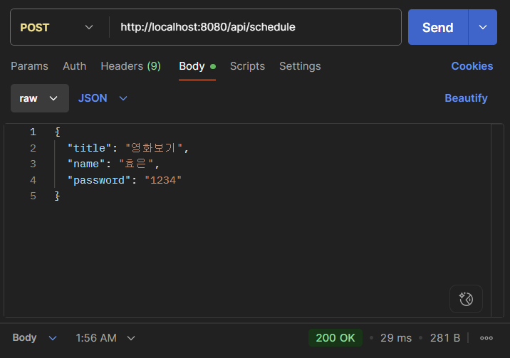
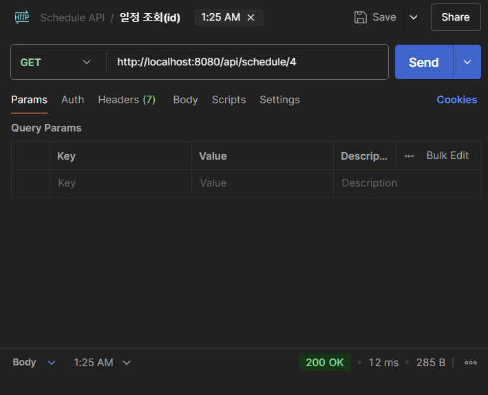
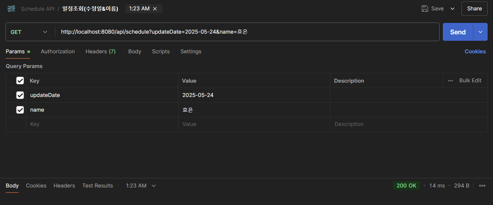
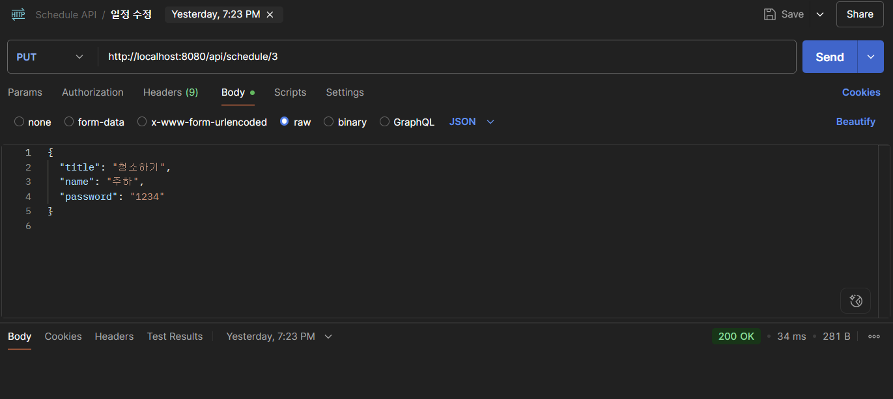
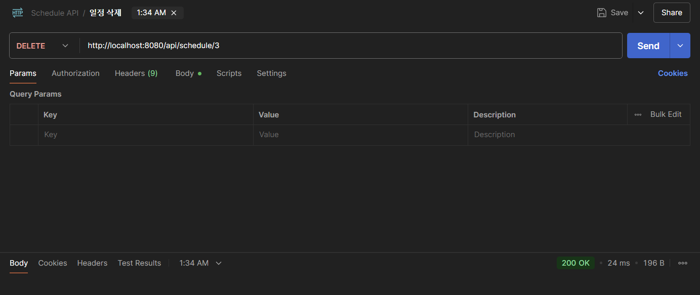
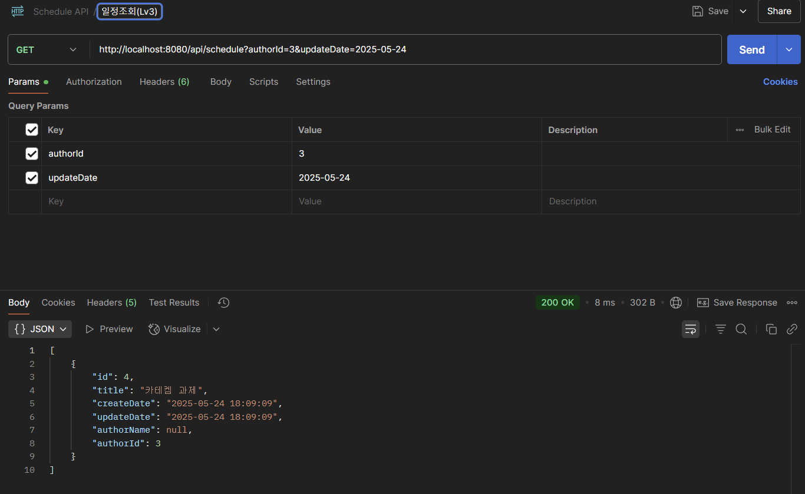
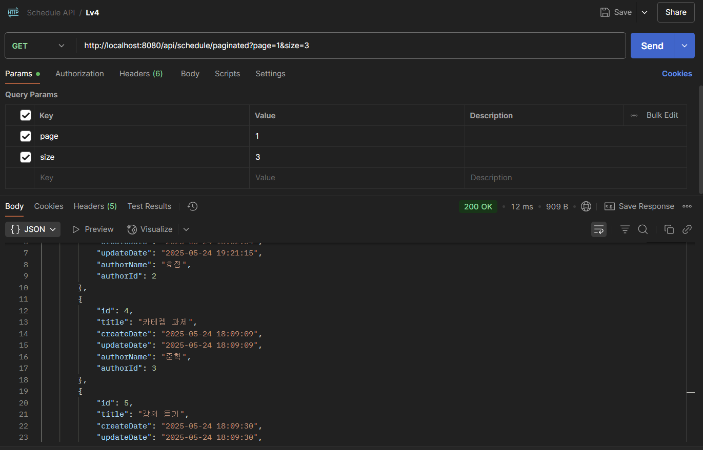
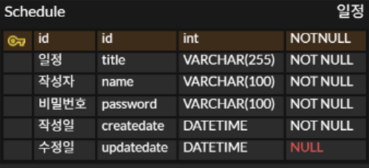

# 일정 관리 시스템

### Lv 0 - API 명세 및 ERD 작성
- [x] **API 명세서**  
  Postman을 통해 작성된 API 명세서를 아래 링크에서 확인  
  👉 [API 문서](https://hyoeunchoi.postman.co/workspace/My-Workspace~35bd902f-2bad-4464-815d-e599dd0a7640/collection/45173639-f47b444a-c27a-419b-93dc-4e04b46fee69?action=share&creator=45173639)

- 
- 
- 
- 
- 
- 
- 

- [x] **ERD(Entity Relationship Diagram)**  
  

- [x] **SQL 테이블 생성**  
  `schedule.sql` 파일을 통해 데이터베이스 테이블을 생성

---
### ✅ Lv 1 - 일정 생성 및 조회
- [x] **일정 생성**  
  사용자가 일정, 작성자명, 비밀번호를 입력해서 일정을 생성
  작성/수정일은 서버 시간 기준으로 자동 생성

- [x] **전체 일정 조회**  
  작성자명(name) 또는 수정일(updateDate) 기준으로 전체 일정을 조회할 수 있다
  조건이 없을 경우 모든 일정이 수정일 기준 내림차순으로 조회된다

- [x] **선택 일정 조회**  
  특정 일정 ID를 기반으로 단일 일정의 상세 정보를 조회할 수 있다

---

### ✅ Lv 2 - 일정 수정 및 삭제
- [x] **선택 일정 수정**  
  비밀번호 인증을 통해 사용자가 제목과 작성자명을 수정할 수 있다
  수정일은 현재 시간으로 바뀌며 작성일은 변경되지 않는다

- [x] **선택 일정 삭제**  
  비밀번호가 일치할 경우 해당 ID의 일정을 삭제할 수 있다

---

### ✅ Lv 3  일정의 연관 관계 설정
- [x] **일정의 연관 관계 설정**  
  일정은 작성자와 연관되어 있으며, 작성자는 여러 일정을 가질 수 있다
  일정 삭제 시 작성자와의 연관 관계도 함께 삭제된다
- [x] **일정 작성자 조회**  
  특정 일정 ID를 기반으로 해당 일정을 작성한 작성자의 정보를 조회할 수 있다
- [x] 기존에는 일정에 작성자 이름만 저장되어 있었지만 **동명이인 문제**와 **데이터 정규화**를 해결하기 위해 작성자를 별도의 테이블(`author`)로 분리
- [x] 일정(`schedule`)과 1:N 관계로 연동

---
✅ Lv 4 - 일정 목록 페이징 처리 (도전 과제)
- [x]  `페이지 번호`와 `페이지 크기`를 쿼리 파라미터로 전달하여 요청하는 항목을 나타냅니다.
- [x]  전달받은 페이지 번호와 크기를 기준으로 쿼리를 작성하여 필요한 데이터만을 조회하고 반환
- [x]  등록된 일정 목록을 `페이지 번호`와 `크기`를 기준으로 모두 조회
- [x]  조회한 일정 목록에는 `작성자 이름`이 포함
- [x]  범위를 넘어선 페이지를 요청하는 경우 빈 배열을 반환
- [x]  Paging 객체를 활용할 수 있음

---

### ✅ Lv 5  예외 발생 처리
- [x] 예외 상황에 대한 처리를 위해 HTTP 상태 코드(링크)와 에러 메시지를 포함한 정보를 사용하여 예외를 관리
- [x]  수정, 삭제 시 요청할 때 보내는 `비밀번호`가 일치하지 않을 때 예외가 발생합니다.
- [x]  선택한 일정 정보를 조회할 수 없을 때 예외가 발생